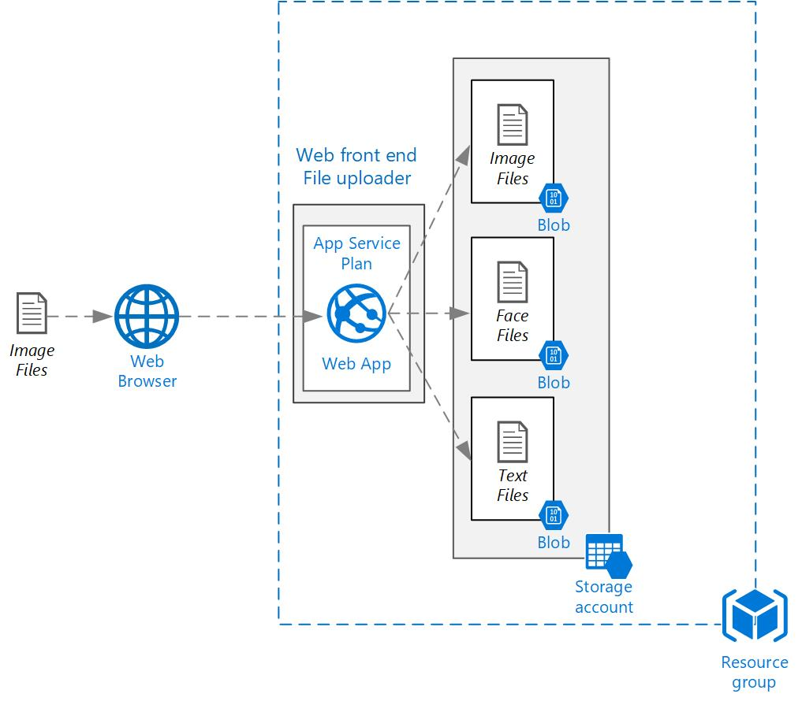

# azure-demo-fileuploader
Day2 Azure Bootcamp - Node.js file upload application for Azure training (Deploy 1st) 

This template creates a storage account, web app services plan, web app and deploys the File Uploader application code from GitHub. 

