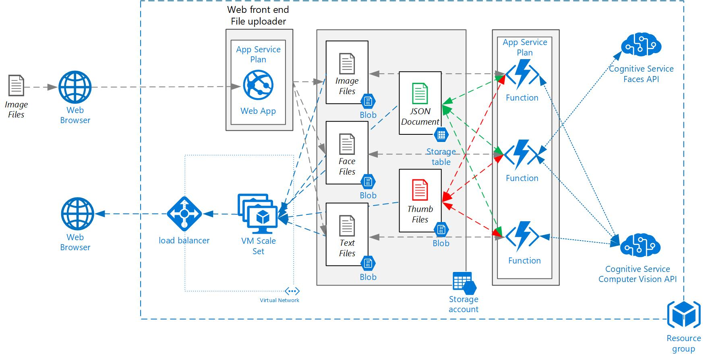

# Azure Bootcamp
For more information on the ANS Azure Bootcamp  visit https://www.ans.co.uk

# Full Application Stack

You can use this template to deploy full application stack. Click on the button below to deploy, once the template has depolyed note down the template outputs as these will be required.  

This template deploys all components of the demo application. 

