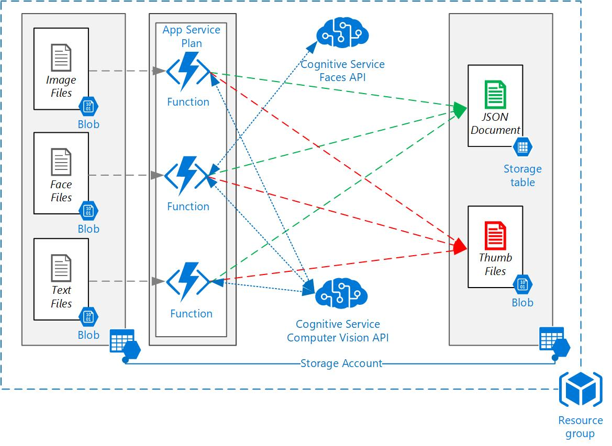

# Azure Bootcamp
For more information on the ANS Azure Bootcamp  visit https://www.ans.co.uk

# Serverless - Middleware
**Deploy this template 2nd**

Node.js function app v2 for Azure training, you can deploy the template using the button below, once the template has depolyed note down the template outputs as these will be required later. 

This template creates a function app and deploys the functions from GitHub. 

