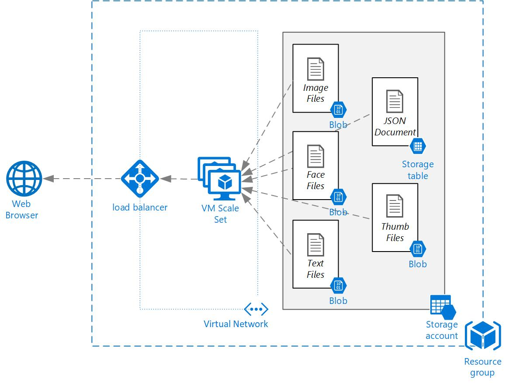

# Azure Bootcamp
For more information on the ANS Azure Bootcamp  visit https://www.ans.co.uk

# VM ScaleSet - File Viewer
**Deploy this template 3rd**

Node.js File Viewer App for Azure training, you can deploy the template using the button below, once the template has depolyed note down the template outputs as these will be required later. 

This template creates a virtual machine scale set and utilise a custome extension to instale Node.Js, download Gallery application code from GitHub and configure the Gallery application to run as a windows service. 

